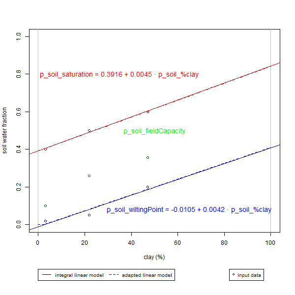

As a temporary measure, we estimate wilting point and saturation horizons (fraction of soil volume), for the single soil layer, using linear models factoring only percent of clay.

These models were derived from Equation 2:3.1.5 in SWAT theoretical documentation:

$$\mathit{WP}_{ly}=0.40·\frac{m_{c}·\rho_{b}}{100}$$
>"where $\mathit{WP}_{ly}$ is the water content at wilting point expressed as a fraction of the total soil volume, $m_{c}$ is the percent clay content of the layer (%), and $\rho_{b}$ is the bulk density for the soil layer ($Mg ·m^{-3}$)".

The soil water balance model currently in use (Wallach et al. 2019) is extremely simple and does not require soil bulk density. Therefore, for now, we abstract $\rho_{b}$. 

We decided to apply the the same logic of linear estimation, but using the coefficients of a complete linear model, fit to the data given in Table 2:3-1, also in SWAT theoretical documentation:

| Texture | Clay Content (% Solids) | Saturation | Field capacity | Permanent wilting point |
|------|------|------|-----|------|
| Sand | 3 % | 0.40 | 0.06 | 0.02 |
| Loam | 22 % | 0.50 | 0.29 | 0.05 |
| Clay | 47 % | 0.60 | 0.41 | 0.20 |

```{r}
input <- data.frame(
  cbind(
    # from SWAT table
    textureType = c("Sand", "Loam", "Clay"),
    clay = c(3, 22, 47),
    sat = c(0.4, 0.5, 0.6),
    wp = c(0.02, 0.05, 0.2),
    # from "soilWaterTable.csv", originally from https://support.rainmachine.com/hc/en-us/articles/228001248-Soil-Types
    fc = c(0.1, 0.26, 0.357)
  )
)
input[,-1] <- lapply(lapply(input[,-1], as.character), as.numeric)

wp.lm <- lm(wp ~ clay, data = input)
sat.lm <- lm(sat ~ clay, data = input)

wp = pmax(round(wp.lm$coefficients[1], 4) + round(wp.lm$coefficients[2], 4) * 0:100, 0)
sat = round(sat.lm$coefficients[1], 4) + round(sat.lm$coefficients[2], 4) * 0:100
```

Using the notation in NetLogo:

$$\textit{p_soil_wiltingPoint}=max(`r round(wp.lm$coefficients[1], 4)`+`r round(wp.lm$coefficients[2], 4)`·\textit{p_soil_%clay}, 0)$$

$$\textit{p_soil_saturation}=`r round(sat.lm$coefficients[1], 4)`+`r round(sat.lm$coefficients[2], 4)`·\textit{p_soil_%clay}$$

In NetLogo, we use the rounded coefficients to up to four decimal digits, considering the lost in precision to be negligible, particularly given the limited data used. The same approach would become more reliable with the inclusion of more data.

```{r}
png("linearEstimationOfSoilWaterHorizons.png", width = 600, height = 600)

layout((matrix(1:2, nrow = 2)), heights = c(10, 1))

# 1. plot
plot(0:100, seq(0, 1, length.out = 101), type = "n", cex = 1.2,
     xlab = "clay (%)", ylab = "soil water fraction")
# mark compositional limits
abline(v = 0, col = "grey")
abline(v = 100, col = "grey")
# mark point data
points(input$clay, input$sat, col = "darkred")
points(input$clay, input$fc, col = "darkgreen")
points(input$clay, input$wp, col = "darkblue")
# draw integral linear model
abline(sat.lm, col = "red")
abline(wp.lm, col = "blue")
# draw adapted linear model
lines(0:100, sat, col = "darkred", lty = 2)
lines(0:100, wp, col = "darkblue", lty = 2)
# write equations
text(35, 0.8, col = "red", cex = 1.2,
     label = paste("p_soil_saturation =", round(sat.lm$coefficients[1], 4),
           "+", round(sat.lm$coefficients[2], 4), "· p_soil_%clay"))
text(50, 0.5, col = "green", cex = 1.2,
     labels = "p_soil_fieldCapacity")
text(65, 0.08, col = "blue", cex = 1.2,
     label = paste("p_soil_wiltingPoint =", round(wp.lm$coefficients[1], 4),
           "+", round(wp.lm$coefficients[2], 4), "· p_soil_%clay"))

# 2. legend
par(mar = rep(0, 4))
plot(0:1, 0:1, type = "n", axes = FALSE, ann = FALSE)
legend(0.1, 1, lty = c(1, 2), legend = c("integral linear model", "adapted linear model"), cex = 0.8, horiz = TRUE)
legend(0.8, 1, pch = c(1), legend = c("input data"), cex = 0.8, horiz = TRUE)

dev.off()
```

```{r}

```

OBS: Data on field capacity per soil texture types is already available from other sources, and used instead of an equation. 

## References {-}

>SWAT theoretical documentation 2009, p. 149, https://swat.tamu.edu/media/99192/swat2009-theory.pdf

> Daniel Wallach, David Makowski, James W. Jones, François Brun (2006, 2014, 2019), 'Working with dynamic crop models: Methods, tools, and examples for agriculture and enviromnent'. Soil Water Balance model described in p. 24-28, R code example in p. 138-144.
