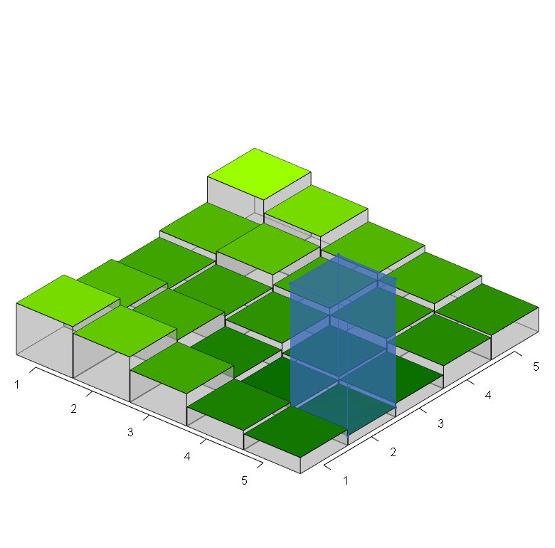

```{r}
library(barplot3d)
library(rgl)
library(grid)
library(gridExtra)
library(png)
```

After the introduction of river water flow (and sea water, if there are elevations are below sea level) and also solving runoff exchanges, it is possible that some downflow patches hold enough surface water for them to be higher than neighbours, in terms of elevation plus average surface water depth. This will happen specially when the value assigned to `riverWaterPerFlowAccumulation` is relatively high (much greater than 1E-4 mm / flow accumulation units). High values of `flow_riverAccumulationAtStart` used in the land model to generate the terrain will also make this situation more frequent. The inundation exchange algorithm redistribute the excess of surface water in each land unit with such excess to their lowest neighbours, in terms of elevation plus surface water depth. To do that, for each land unit with excess, the surface water of the entire Moore neighbourhood is aggregated, divided into arbitrarily small parts, which are added to the current lowest land unit within the neighbourhood, including the central land unit. The small parts' dimension (`errorToleranceThreshold`) serves also has a threshold criterium below which differences between land unit heights are deemed negligible.

## Functions

```{r}
source("source/inundationExchange.R")
```

```{r}
solveInundationExchange
```

```{r}
getPatchesWithExcessWater
```

```{r}
hasExcessWater
```

```{r}
getHeights
```

```{r}
getMooreNeighborhood
```

```{r}
getPatchValuesFromMatrix
```

```{r}
setPatchValuesFromMatrix
```

```{r}
getLowestPatchInNeighborhood
```

## Setting up an example in R

### Input: elevation

To illustrate the inundation algorithm, we only require elevation, not flow direction and accumulation. Note that elevation values would be typically expressed in metres, though here we use values between 0 and 1 to ease the graphical representation (thus the scalling transformations used later on plots).

```{r}
elevation <- matrix( c(0.8,  0.6,  0.5,  0.6,  1,
                       0.7,  0.52, 0.45, 0.65, 0.8,
                       0.5,  0.3,  0.4,  0.5,  0.6,
                       0.3,  0.2,  0.25, 0.4,  0.5,
                       0.25, 0.15, 0.21, 0.35, 0.38),
                     nrow = 5, ncol = 5, byrow = T)

elevationGradient <- 100 + (155 * ((elevation - min(elevation)) / (max(elevation) - min(elevation) + 1E-6)))

inputdataColours <- rgb((elevationGradient - 100) / 255, 
                        (elevationGradient / 255), 
                        0)
```

```{r, eval=FALSE}
# plot in rgl device
barplot3d(rows = 5, cols = 5,
          z = elevation,
          scalexy = 1,
          gap = 0.01,
          alpha = 0.4,
          theta = 40, phi = 30,
          topcolors = inputdataColours,
          xlabels = 1:5, ylabels = 1:5,
          #xsub = "rows", ysub = "columns", zsub = "elevation"
          gridlines = F
)

# save snapshot
par3d(windowRect = c(20, 30, 800, 800))
snapshot3d("flowAccumulationOrder_plot1.png")
```

```{r}
knitr::include_graphics("flowAccumulationOrder_plot1.png")
```

### Execution

Initialise surface water layer as a large amount concentrated at the lowest land unit:
```{r}
surfaceWater <- matrix( rep(0 , 25), nrow = 5, ncol = 5, byrow = T)

indexOfLowestPatch <- (1:length(elevation))[which.min(elevation)] - 1

surfaceWater[(indexOfLowestPatch %% ncol(surfaceWater)) + 1, 
             (indexOfLowestPatch %/% ncol(surfaceWater)) + 1] <- 1000
```

Plot surface water levels before inundation exchange:
```{r, eval = FALSE}
surfaceWaterColour <- rgb(0.2, 0.4, 0.7)

# plot in rgl device
barplot3d(rows = 5, cols = 5,
          z = elevation,
          scalexy = 1,
          gap = 0.01,
          alpha = 0.4,
          theta = 40, phi = 30,
          topcolors = inputdataColours,
          xlabels = 1:5, ylabels = 1:5, zlabels = FALSE,
          #xsub = "rows", ysub = "columns", zsub = "elevation"
          gridlines = FALSE
)

waterCube <- cube3d(color = surfaceWaterColour, alpha = 0.5)  

for (x in 1:dim(elevation)[1])
{
  for (z in 1:dim(elevation)[2])
  {
    if (surfaceWater[x, z] > 0)
    {
      thisWaterCube <- waterCube %>% 
        scale3d(0.5, surfaceWater[x, z] / 1000, 0.5) %>% 
        translate3d(x + 0.5, elevation[x, z] + surfaceWater[x, z] / 1000, -1 * z - 0.5)
      shade3d(thisWaterCube)
      points3d(t(thisWaterCube$vb), size=5, color = surfaceWaterColour)
      for (i in 1:6)
        lines3d(t(thisWaterCube$vb)[thisWaterCube$ib[,i],], color = surfaceWaterColour)
    }
  }
}

# save snapshot
par3d(windowRect = c(20, 30, 800, 800))
snapshot3d("inundationExchange_plot1.png")
```

```{r}

```

```{r, eval=FALSE}
rgl.close()
```

Execute one iteration of the inundation exchange algorithm:

```{r}
surfaceWater <- solveInundationExchange(elevation = elevation, 
                                        surfaceWater = surfaceWater,
                                        errorToleranceThreshold = 0.01,
                                        maxIterations = 1000) 
```

For better performance, `errorToleranceThreshold` must be set in a sensible scale compare to elevation values (here, these are values between 0 and 1, instead of actual metres). If this parameter and the grid is too small, the while loop can get stuck and `maxIterations` will be exhausted (execution takes much longer)---thus, here we also decrease maxIterations. Because the scale of water depth (mm) is purposely exagerated, the differences between patches will appear far greater in this example.

Plot surface water levels after runoff exchange:
```{r, eval = FALSE}
surfaceWaterColour <- rgb(0.2, 0.4, 0.7)

# plot in rgl device
barplot3d(rows = 5, cols = 5,
          z = elevation,
          scalexy = 1,
          gap = 0.01,
          alpha = 0.4,
          theta = 40, phi = 30,
          topcolors = inputdataColours,
          xlabels = 1:5, ylabels = 1:5, zlabels = FALSE,
          #xsub = "rows", ysub = "columns", zsub = "elevation"
          gridlines = FALSE
)

waterCube <- cube3d(color = surfaceWaterColour, alpha = 0.5)  

for (x in 1:dim(elevation)[1])
{
  for (z in 1:dim(elevation)[2])
  {
    if (surfaceWater[x, z] > 0)
    {
      thisWaterCube <- waterCube %>% 
        scale3d(0.5, surfaceWater[x, z] / 1000, 0.5) %>% 
        translate3d(x + 0.5, elevation[x, z] + surfaceWater[x, z] / 1000, -1 * z - 0.5)
      shade3d(thisWaterCube)
      points3d(t(thisWaterCube$vb), size=5, color = surfaceWaterColour)
      for (i in 1:6)
        lines3d(t(thisWaterCube$vb)[thisWaterCube$ib[,i],], color = surfaceWaterColour)
    }
  }
}

# save snapshot
par3d(windowRect = c(20, 30, 800, 800))
snapshot3d("inundationExchange_plot2.png")
```

```{r}

```

```{r, eval=FALSE}
rgl.close()
```


