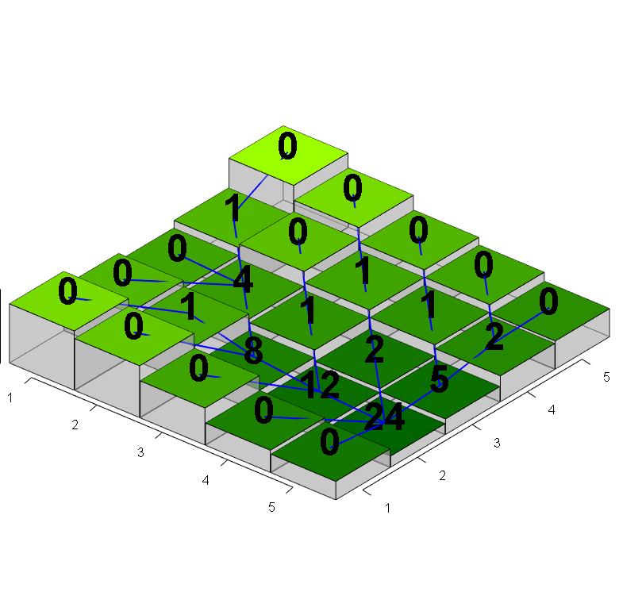
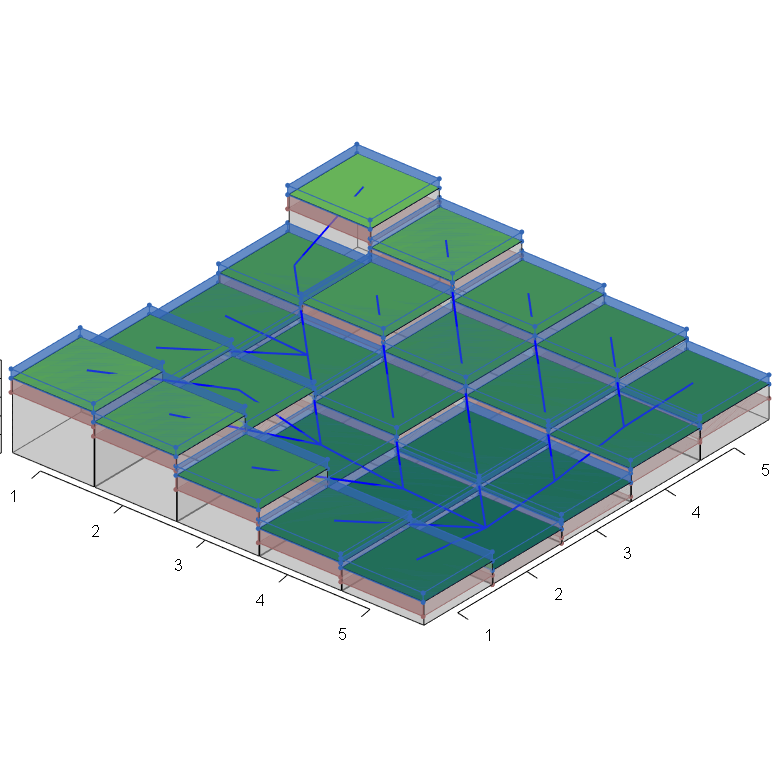
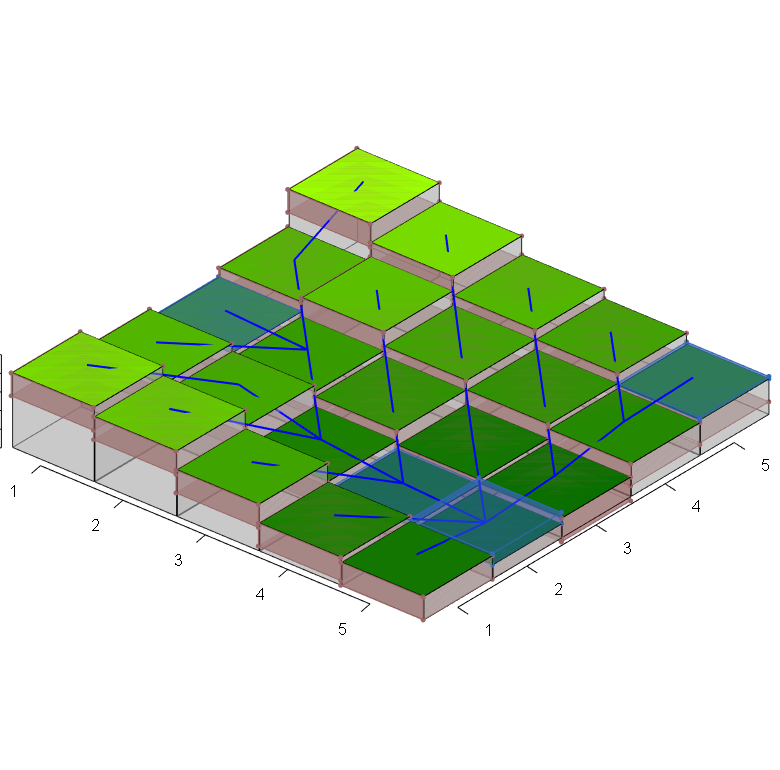

```{r}
library(barplot3d)
library(rgl)
library(grid)
library(gridExtra)
library(png)
```

The runoff exchange algorithm reorganise the part of the Soil Water Balance model dealing with fractioning input water into runoff and soil water. This algorithm solves the order of the transmission of runoff between land units, following a given flow structure. The algorithm is based on two published algorithms (see below).

The approach used to set the order of runoff exchange follows the same logic used to calculate flow_accumulation in the Land model, based on: 

>Jenson, S. K., & Domingue, J. O. (1988). Extracting topographic structure from digital elevation data for geographic information system analysis. Photogrammetric engineering and remote sensing, 54(11), 1593-1600.

The specific fragment explaining the algorithm is the following:

>"FLOW ACCUMULATION DATA SET
>The third procedure of the conditioning phase makes use of the flow direction data set to create the flow accumulation data set, where each cell is assigned a value equal to the number of cells that flow to it (O’Callaghan and Mark, 1984). Cells having a flow accumulation value of zero (to which no other cells flow) generally correspond to the pattern of ridges. Because all cells in a depressionless DEM have a path to the data set edge, the pattern formed by highlighting cells with values higher than some threshold delineates a fully connected drainage network. As the threshold value is increased, the density of the drainage network decreases. The flow accumulation data set that was calculated for the numeric example is shown in Table 2d, and the visual example is shown in Plate 1c." (p. 1594)

See "indus-village-model\\03-land-model\\documentation\\flowAccumulationOrder.Rmd" materials or the [HTML with R walkthrough](https://htmlpreview.github.io/?https://github.com/Andros-Spica/indus-village-model/blob/master/03-land-model/documentation/flowAccumulationOrder.html) for further details.

The algorithm calculating the runoff moving from one land unit to another is a simplification of the one found on:

>Yang L. E., Scheffran J., Süsser D., Dawson R. and Chen Y. D. (2018) Assessment of Flood Losses with Household Responses: Agent-Based Simulation in an Urban Catchment Area Environ. Model. Assess. 23 369–88. http://link.springer.com/10.1007/s10666-018-9597-3

Their model is already a simplified model compared to other within the field. Their model approximate the amount of water in raster cell $i$ as 'water depth' ($WD_{i}$) which flow to a neighbouring cell $j$ according to the relative difference between water surface elevations:

---

$\text{if }E_i>(E_j+WD_{j,t}+WD_{i,t})$
$$WD_{i,t+1}=\frac{1}{2}(E_i+WD_{i,t}+E_j+WD_{j,t})-E_i$$
$$WD_{j,t+1}=\frac{1}{2}(E_i+WD_{i,t}+E_j+WD_{j,t})-E_j$$

$\text{else }$

$$WD_{i,t+1}=0$$
$$WD_{j,t+1}=WD_{j,t}+WD_{i,t}$$

---


## Functions

At this point of development (i.e. integrated models), the original soil water balance model is broken down into parts to better connect to the inputs/outputs of other modules and fit the solution for runoff exchange. Note that because of these changes, the original R implementation (`watbal.model.R`) by Wallach et al. 2012 is no longer used.

```{r}
source("source/watbal.model_withRunoffExchange.R")
```

```{r}
solveRunoffExchange
```

```{r}
setInitialState
```

```{r}
setRunoff
```

```{r}
infiltrateSoilWater
```

```{r}
tryToSendRunoff
```

## Setting up an example in R

### Input: elevation and flow direction

See extended explanation at [HTML with R walkthrough](https://htmlpreview.github.io/?https://github.com/Andros-Spica/indus-village-model/blob/master/03-land-model/documentation/flowAccumulationOrder.html). Note that elevation values would be typically expressed in metres, though here we use values between 0 and 1 to ease the graphical representation. Also note that flow accumulation is only shown for illustrative purposes while it is not required by the runoff exchange algorithm.

```{r}
elevation <- matrix( c(0.8,  0.6,  0.5,  0.6,  1,
                       0.7,  0.52, 0.45, 0.65, 0.8,
                       0.5,  0.3,  0.4,  0.5,  0.6,
                       0.3,  0.2,  0.25, 0.4,  0.5,
                       0.25, 0.15, 0.21, 0.35, 0.38),
                     nrow = 5, ncol = 5, byrow = T)

elevationGradient <- 100 + (155 * ((elevation - min(elevation)) / (max(elevation) - min(elevation) + 1E-6)))

inputdataColours <- rgb((elevationGradient - 100) / 255, 
                        (elevationGradient / 255), 
                        0)

# function for detecting flow direction
getDownstream <- function(x, y, elevationMatrix)
{
  #print(paste("patch ", x, ", ", y))
  minDownstreamElevation = elevationMatrix[x, y]
  downstreamCoords = NULL
  
  for (dx in -1:1)
  {
    if (x + dx > 0 & x + dx <= ncol(elevationMatrix))
    {
      for (dy in -1:1)
      {
        if (y + dy > 0 & y + dy <= ncol(elevationMatrix) & 
            (dx == 0 & dy == 0) == FALSE)
        {
          #print(paste(x + dx, y + dy))
          if (elevationMatrix[x + dx, y + dy] < minDownstreamElevation)
          {
            minDownstreamElevation = elevationMatrix[x + dx, y + dy]
            downstreamCoords = c(x + dx, y + dy)
          }
        }
      }
    }
  }
  
  return(downstreamCoords)
}

# flow links
flowDirection <- c()
for (x in 1:nrow(elevation))
{
  for (y in 1:nrow(elevation))
  {
    downstreamPoint = getDownstream(x, y, elevation)
    if (!is.null(downstreamPoint))
    {
      flowDirection <- c(flowDirection, c(x, y, downstreamPoint))
    }
  }
}

flowDirection <- matrix(flowDirection, 
                    ncol = 4, 
                    nrow = length(flowDirection) / 4, 
                    byrow = T)

# set initial values
flowReceive <- matrix(rep(FALSE, length(elevation)), 
                       nrow = nrow(elevation), ncol = ncol(elevation))
flowAccumulationState <- matrix(rep("start", length(elevation)), 
                       nrow = nrow(elevation), ncol = ncol(elevation))
flowAccumulation <- matrix(rep(0, length(elevation)), 
                       nrow = nrow(elevation), ncol = ncol(elevation))

# separate those not receiving flow
for (x in 1:nrow(elevation))
{
  for (y in 1:nrow(elevation))
  {
    downstreamPoint = getDownstream(x, y, elevation)
    if (!is.null(downstreamPoint))
    {
      flowReceive[downstreamPoint[1], downstreamPoint[2]] = TRUE
      flowAccumulationState[downstreamPoint[1], downstreamPoint[2]] = "pending"
    }
  }
}

areInflowNeighboursDone <- function(x, y, stateMatrix, elevationMatrix)
{
  neighboursAreDone = TRUE
  
  for (dx in -1:1)
  {
    if (x + dx > 0 & x + dx <= ncol(stateMatrix))
    {
      for (dy in -1:1)
      {
        if (y + dy > 0 & y + dy <= ncol(stateMatrix) & 
            (dx == 0 & dy == 0) == FALSE)
        {
          flowTarget = getDownstream(x + dx, y + dy, elevationMatrix)
          
          if (!is.null(flowTarget) &&
              all(flowTarget == c(x, y)) && 
              stateMatrix[x + dx, y + dy] != "done")
          {
            neighboursAreDone = FALSE
          }
        }
      }
    }
  }
  
  return(neighboursAreDone)
}

currentStep = 1
maxIterations = 30 # just as a safety measure, to avoid infinite loop
while(maxIterations > currentStep & 
      "start" %in% flowAccumulationState &
      "pending" %in% flowAccumulationState)
{
  # select one land unit with flowAccumulationState == "start"
  sourcePoint = which(flowAccumulationState == "start", arr.ind = T)[1,]
  
  # find downstream point
  downstreamPoint = getDownstream(sourcePoint[1], sourcePoint[2], elevation)
  
  # add accumulation at source plus 1 to flow accumulation downstream
  flowAccumulation[downstreamPoint[1], downstreamPoint[2]] = flowAccumulation[downstreamPoint[1], downstreamPoint[2]] +
    flowAccumulation[sourcePoint[1], sourcePoint[2]] + 1
  
  # set source state as "done"
  flowAccumulationState[sourcePoint[1], sourcePoint[2]] = "done"
  
  # if all downstream's neigbours are "done", set its state as "start" 
  if (areInflowNeighboursDone(downstreamPoint[1], 
                              downstreamPoint[2], 
                              flowAccumulationState, 
                              elevation))
  {
    flowAccumulationState[downstreamPoint[1], downstreamPoint[2]] = "start"
  }
  
  currentStep = currentStep + 1
}
```

```{r, eval=FALSE}
# plot in rgl device
barplot3d(rows = 5, cols = 5,
          z = elevation,
          scalexy = 1,
          gap = 0.01,
          alpha = 0.4,
          theta = 40, phi = 30,
          topcolors = inputdataColours,
          xlabels = 1:5, ylabels = 1:5,
          #xsub = "rows", ysub = "columns", zsub = "elevation"
          gridlines = F
)

for (i in 1:nrow(flowDirection))
{
  # notice that x, y, z are interpreted differently than in barplot3d
  segments3d(x = flowDirection[i, c(1, 3)]+0.5,
             z = -1*flowDirection[i, c(2, 4)]-0.5,
             y = c(elevation[flowDirection[i, 1], flowDirection[i, 2]],
                   elevation[flowDirection[i, 3], flowDirection[i, 4]])+0.05,
             color = "blue", lwd = 2)
}

# mark flow accumulation values
for (x in 1:nrow(elevation))
{
  for (y in 1:nrow(elevation))
  {
    # notice that x, y, z are interpreted differently than in barplot3d
    text3d(x = x+0.5, y = elevation[x, y]+0.2, z = -1*y-0.5,
           text = flowAccumulation[x, y],
           cex = 3, font = 2)
  }
}

# save snapshot
par3d(windowRect = c(20, 30, 800, 800))
snapshot3d("flowAccumulationOrder_plot5.png")
```

```{r}

```

### Input: weather variables

In sake of simplicity, this example will use fixed weather variables and only a single day (iteration) is executed:

```{r}
weather <- list(
  I = 18,
  T2M = 22,
  Tmax = 25,
  Tmin = 20,
  RAIN = 50
)
```

Calculate reference evapotranspiration according to elevations and weather variables (wind speed and temperature of dew point set to the default values in `estimateETr.R`):

```{r}
source("source/estimateETr.R")

ETr <- matrix( rep(0 , 25), nrow = 5, ncol = 5, byrow = T)

for (i in 1:5)
{
  for (j in 1:5)
  {
    ETr[i, j] <- estimateETr(weather$I, weather$T2M, weather$Tmax, weather$Tmin, z = elevation[i, j])
  }
}
```

### Input: soil parameters

Define parameters of the Soil Water Balance model (for this example, assumed to be homogeneous across the terrain):

```{r}
parameters <- list(
  # root zone depth (mm)
  rootDepthZone = 400,
  
  # (root) Water Uptake coefficient (mm^3.mm^-3) (MUF)
  rootWaterUptakeCoefficient = 0.096,
  
  # runoff curve number (0=full retention to 100=full impermeability)
  runoffCurveNumber = 65,
  
  #  saturation (fraction of soil volume)
  soilWaterSaturation = 0.5,
  
  # field capacity (fraction of soil volume)
  fieldCapacity = 0.19,
  
  # permanent wilting point (fraction of soil volume)
  wiltingPoint = 0.06,
  
  # saturated hydraulic conductivity or fraction of soil water above field capacity drained per day (mm/day)
  soil.deepDrainageCoefficient = 0.55,
  
  # water holding capacity (fraction of soil volume)
  soil.waterHoldingCapacity = 0.15
)
```

### Execution

Initialise water layers (surface water, runoff and soil water). Surface water is here equal to precipitation and soil water starts at field capacity:
```{r}
waterLayers <- list(
  surfaceWater = matrix( rep(weather$RAIN , 25), nrow = 5, ncol = 5, byrow = T),
  runoff = matrix( rep(0 , 25), nrow = 5, ncol = 5, byrow = T),
  soilWater = matrix( rep(parameters$rootDepthZone * parameters$fieldCapacity, 25), nrow = 5, ncol = 5, byrow = T)
)
```

Plot surface water levels before runoff exchange:
```{r, eval = FALSE}
surfaceWaterColour <- rgb(0.2, 0.4, 0.7)
soilWaterColor <- rgb(0.6, 0.4, 0.4)

# plot in rgl device
barplot3d(rows = 5, cols = 5,
          z = elevation,
          scalexy = 1,
          gap = 0.01,
          alpha = 0.4,
          theta = 40, phi = 30,
          topcolors = inputdataColours,
          xlabels = 1:5, ylabels = 1:5,
          #xsub = "rows", ysub = "columns", zsub = "elevation"
          gridlines = F
)

for (i in 1:nrow(flowDirection))
{
  # notice that x, y, z are interpreted differently than in barplot3d
  segments3d(x = flowDirection[i, c(1, 3)]+0.5,
             z = -1*flowDirection[i, c(2, 4)]-0.5,
             y = c(elevation[flowDirection[i, 1], flowDirection[i, 2]],
                   elevation[flowDirection[i, 3], flowDirection[i, 4]])+0.05,
             color = "blue", lwd = 2)
}

waterCube <- cube3d(color = surfaceWaterColour, alpha = 0.5)  

for (x in 1:dim(elevation)[1])
{
  for (z in 1:dim(elevation)[2])
  {
    if (waterLayers$surfaceWater[x, z] > 0)
    {
      thisWaterCube <- waterCube %>% 
        scale3d(0.5, waterLayers$surfaceWater[x, z] / 1000, 0.5) %>% 
        translate3d(x + 0.5, elevation[x, z] + waterLayers$surfaceWater[x, z] / 1000, -1 * z - 0.5)
      shade3d(thisWaterCube)
      points3d(t(thisWaterCube$vb), size=5, color = surfaceWaterColour)
      for (i in 1:6)
        lines3d(t(thisWaterCube$vb)[thisWaterCube$ib[,i],], color = surfaceWaterColour)
    }
  }
}

waterCube <- cube3d(color = soilWaterColor, alpha = 0.5)  

for (x in 1:dim(elevation)[1])
{
  for (z in 1:dim(elevation)[2])
  {
    if (waterLayers$soilWater[x, z] > 0)
    {
      thisWaterCube <- waterCube %>% 
        scale3d(0.5, waterLayers$soilWater[x, z] / 1000, 0.5) %>% 
        translate3d(x + 0.5, elevation[x, z] - waterLayers$soilWater[x, z] / 1000, -1 * z - 0.5)
      shade3d(thisWaterCube)
      points3d(t(thisWaterCube$vb), size=5, color = soilWaterColor)
      for (i in 1:6)
        lines3d(t(thisWaterCube$vb)[thisWaterCube$ib[,i],], color = soilWaterColor)
    }
  }
}

# save snapshot
par3d(windowRect = c(20, 30, 800, 800))
snapshot3d("runoffExchange_plot1.png")
```

```{r}

```

```{r, eval=FALSE}
rgl.close()
```

Execute one iteration of the runoff exchange algorithm:

```{r}
waterLayers <- solveRunoffExchange(elevation = elevation, 
                                   flowDirection = flowDirection,
                                   waterLayers = waterLayers,
                                   runoffCurveNumber = parameters$runoffCurveNumber, 
                                   soilWaterSaturation = parameters$soilWaterSaturation, 
                                   rootDepthZone = parameters$rootDepthZone)
```

Plot surface water levels after runoff exchange:
```{r, eval = FALSE}
surfaceWaterColour <- rgb(0.2, 0.4, 0.7)
soilWaterColor <- rgb(0.6, 0.4, 0.4)

# plot in rgl device
barplot3d(rows = 5, cols = 5,
          z = elevation,
          scalexy = 1,
          gap = 0.01,
          alpha = 0.4,
          theta = 40, phi = 30,
          topcolors = inputdataColours,
          xlabels = 1:5, ylabels = 1:5,
          #xsub = "rows", #ysub = "columns", zsub = "elevation"
          gridlines = F
)

for (i in 1:nrow(flowDirection))
{
  # notice that x, y, z are interpreted differently than in barplot3d
  segments3d(x = flowDirection[i, c(1, 3)]+0.5,
             z = -1*flowDirection[i, c(2, 4)]-0.5,
             y = c(elevation[flowDirection[i, 1], flowDirection[i, 2]],
                   elevation[flowDirection[i, 3], flowDirection[i, 4]])+0.05,
             color = "blue", lwd = 2)
}

waterCube <- cube3d(color = surfaceWaterColour, alpha = 0.5)  

for (x in 1:dim(elevation)[1])
{
  for (z in 1:dim(elevation)[2])
  {
    if (waterLayers$surfaceWater[x, z] > 0)
    {
      thisWaterCube <- waterCube %>% 
        scale3d(0.5, waterLayers$surfaceWater[x, z] / 1000, 0.5) %>% 
        translate3d(x + 0.5, elevation[x, z] + waterLayers$surfaceWater[x, z] / 1000, -1 * z - 0.5)
      shade3d(thisWaterCube)
      points3d(t(thisWaterCube$vb), size=5, color = surfaceWaterColour)
      for (i in 1:6)
        lines3d(t(thisWaterCube$vb)[thisWaterCube$ib[,i],], color = surfaceWaterColour)
    }
  }
}

waterCube <- cube3d(color = soilWaterColor, alpha = 0.5)  

for (x in 1:dim(elevation)[1])
{
  for (z in 1:dim(elevation)[2])
  {
    if (waterLayers$soilWater[x, z] > 0)
    {
      thisWaterCube <- waterCube %>% 
        scale3d(0.5, waterLayers$soilWater[x, z] / 1000, 0.5) %>% 
        translate3d(x + 0.5, elevation[x, z] - waterLayers$soilWater[x, z] / 1000, -1 * z - 0.5)
      shade3d(thisWaterCube)
      points3d(t(thisWaterCube$vb), size=5, color = soilWaterColor)
      for (i in 1:6)
        lines3d(t(thisWaterCube$vb)[thisWaterCube$ib[,i],], color = soilWaterColor)
    }
  }
}

# save snapshot
par3d(windowRect = c(20, 30, 800, 800))
snapshot3d("runoffExchange_plot2.png")
```

```{r}

```

```{r, eval=FALSE}
rgl.close()
```


