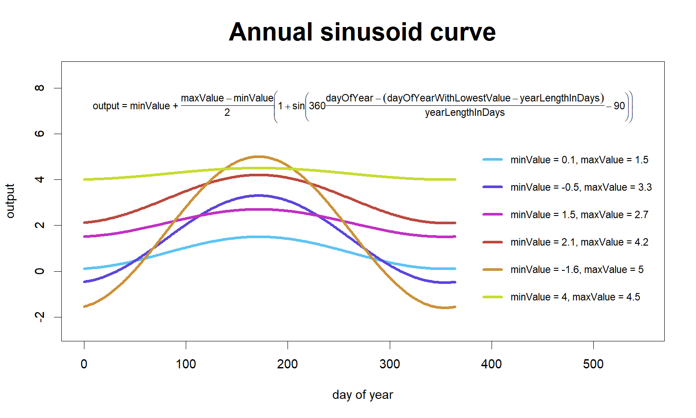

## Load source file {-}

```{r}
source("source/weatherModel.R")
```

## Base generic functions {-}

### Sinusoidal curve with fluctuations {-}

Generic function for geting points in sinusoidal curves depending on minValue, maxValue, length of year in days, and a normal stochastic fluctuation. See extended explanation at [HTML with R walkthrough](https://htmlpreview.github.io/?https://github.com/Andros-Spica/indus-village-model/blob/master/01-weather/documentation/annualSinusoidCurve.html).

```{r, out.width = "\\textwidth"}

```

### Annual cumulative daily precipitation using escalonated double logistic curve {-}

Generic function for geting an year of daily precipitation. First, it generates a double logistic curve of range 0-1 depending on start and end days of year, a plateau value (intermediate value), and two sets of point of inflection and growth rate. See extended explanation at [HTML with R walkthrough](https://htmlpreview.github.io/?https://github.com/Andros-Spica/indus-village-model/blob/master/01-weather/documentation/doubleLogisticCurve.html). Then, the curve is broken down stochastically into steps, controlled by `nSample` and `maxSampleSize`, which better represents the discretionality of precipitation events. Finally, the cumulative daily value is transformed into daily increments, which is multiplied by the annualSum, returning daily precipitation values. 

```{r, out.width = "\\textwidth"}

```

### Reference evapotranspiration {-}

TO-DO

```{r}
estimateETr
```

```{r, out.width = "\\textwidth"}
#knitr::include_graphics("XXXXXX.png")
```

## Auxiliar functions {-}

An auxiliar function to simplify code with long variable names:

```{r}
getLastItemInVector
```

Function for marking the end of each year:

```{r}
markEndYears
```

## The model main procedures {-}

```{r}
weatherModel.init
```

```{r}
weatherModel.run
```

# Running the model {-}

## Initialise {-}

```{r}
weatherModel <- weatherModel.init()
```

Show table with parameter values:

```{r}
parvalues <- c(
  weatherModel$PARS[[1]],
  weatherModel$PARS[[2]],
  weatherModel$PARS[[3]],
  weatherModel$PARS[[4]]
)
parNames <- c("seed", "yearLengthInDays", "albedo", "southHemisphere")

for (j in 5:length(weatherModel$PARS))
{
  parGroupName <- names(weatherModel$PARS)[j]
  for (i in 1:length(weatherModel$PARS[[j]]))
  {
    parvalues <- c(
      parvalues,
      weatherModel$PARS[[j]][[i]]
    )
    parName <- paste(parGroupName, names(weatherModel$PARS[[j]])[i], sep = " - ")
    parNames <- c(parNames, parName)
  }
}

parvalues <- cbind(parNames, parvalues)
knitr::kable(parvalues, 
             format = "html",
             col.names = c("parameter", "values"),
             align = c("l", "r"))
```

## Run {-}

Run for 5 years:

```{r}
set.seed(0)
weatherModel <- weatherModel.run(weatherModel, numberOfYears = 5)
```

## Plot results

Set colours for maximum and minimum temperature:

```{r}
maxTemperatureColour = hsv(7.3/360, 74.6/100, 70/100)

minTemperatureColour = hsv(232/360, 64.6/100, 73/100)
```

Plot time-series:

```{r}
lengthOfSimulation = length(weatherModel$daily$currentYear)

#--------
plotName = "weatherModelExample.png"

grScale = 2
fontRescale = 0
fontRescaleDay = 0

png(plotName, width = grScale * 600, height = grScale * 700)
#---------
# alternatively, to create eps file:
#---------
# plotName = "FigX-weatherModelExample.eps"
# 
# grScale = 1.2
# fontRescale = 0.1
# fontRescaleDay = -0.5 # to adjust unexpected scale behaviour in mtext
# 
# extrafont::loadfonts(device = "postscript")
# grDevices::cairo_ps(file = plotName,
#                       pointsize = 12,
#                       width = grScale * 6,
#                       height = grScale * 7,
#                       onefile = FALSE,
#                       family = "sans")
#---------

layout(matrix(c(1:10), 
              nrow = 5, ncol = 2, byrow = FALSE), 
       widths = c(1, 10),
       heights = c(10, 10, 10, 12, 2))

yLabs <- c(expression(paste("    Solar\nRadiation (", MJ/m^-2, ")")), 
           "Temperature (C)", 
           "ETr (mm)",
           "Precipitation (mm)")

par(cex = grScale)

# First column

par(mar = c(0, 0, 0, 0))

plot(c(0, 1), c(0, 1), ann = F, bty = 'n', type = 'n', xaxt = 'n', yaxt = 'n')
text(x = 0.5, y = 0.5, font = 4, 
     cex = grScale * (0.6 + fontRescale), 
     srt = 90,
     labels = yLabs[1])

plot(c(0, 1), c(0, 1), ann = F, bty = 'n', type = 'n', xaxt = 'n', yaxt = 'n')
text(x = 0.5, y = 0.5, font = 4, 
     cex = grScale * (0.7 + fontRescale), 
     srt = 90,
     labels = yLabs[2])

plot(c(0, 1), c(0, 1), ann = F, bty = 'n', type = 'n', xaxt = 'n', yaxt = 'n')
text(x = 0.5, y = 0.6, font = 4, 
     cex = grScale * (0.7 + fontRescale), 
     srt = 90,
     labels = yLabs[3])

plot(c(0, 1), c(0, 1), ann = F, bty = 'n', type = 'n', xaxt = 'n', yaxt = 'n')
text(x = 0.5, y = 0.6, font = 4, 
     cex = grScale * (0.7 + fontRescale), 
     srt = 90,
     labels = yLabs[4])

plot(c(0, 1), c(0, 1), ann = F, bty = 'n', type = 'n', xaxt = 'n', yaxt = 'n')

# Second column

par(mar = c(0.2, 1, 0.5, 0.1), 
    cex.axis = grScale * (0.6 + fontRescale))

# 1: Solar radiation
plot(1:lengthOfSimulation, weatherModel$daily$solarRadiation, type = "l",
     xlab = "", xaxt = 'n',
     ylab = "")
markEndYears(lengthOfSimulation)

# 2: Temperature
plot(1:lengthOfSimulation, weatherModel$daily$temperature, type = "l",
     xlab = "", xaxt = 'n',
     ylab = "")
lines(1:lengthOfSimulation, weatherModel$daily$temperature_max, 
      col = adjustcolor(maxTemperatureColour, alpha.f = 0.8))
lines(1:lengthOfSimulation, weatherModel$daily$temperature_min, 
      col = adjustcolor(minTemperatureColour, alpha.f = 0.8))

markEndYears(lengthOfSimulation)

# 3: Reference evapotranspiration

plot(1:lengthOfSimulation, weatherModel$daily$ETr, type = "l",
     ylab = "",
     xlab = "", xaxt = 'n')
markEndYears(lengthOfSimulation)

# 4: Precipitation
par(mar = c(2, 1, 0.1, 0.1))

barplot(weatherModel$daily$precipitation, 
        ylab = "",
        #names.arg = 1:lengthOfSimulation,
        xlab = "", xaxt = 'n')
markEndYears(lengthOfSimulation
             , offset = 1.2)
abline(v = lengthOfSimulation * 1.2, lty = 3)
# not sure why, but barplot() x coordinates do not behave as in plot()

# 5:  x-axis title

par(mar = c(1, 1, 0, 0.1))

plot(c(1, lengthOfSimulation), c(0, 1), ann = F, bty = 'n', type = 'n', xaxt = 'n', yaxt = 'n')

axis(3, 
     at = 1:lengthOfSimulation,
     tck = 0, lwd = 0)

mtext("day", side = 1, line = -1,
      font = 4, cex = grScale * (1.7 + fontRescale + fontRescaleDay))
dev.off()
```

```{r, out.width = "\\textwidth"}
knitr::include_graphics(plotName)
```

