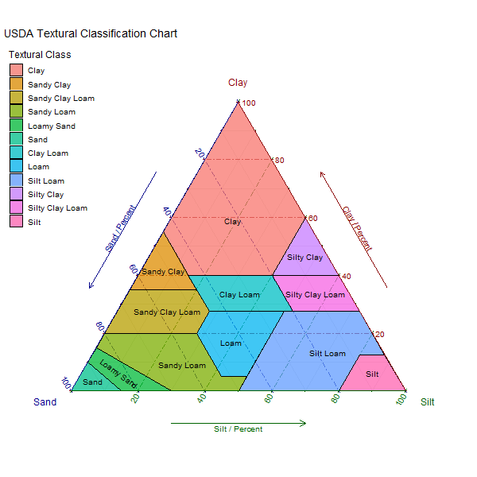

Loading the USDA Textural Soil Classification from ggtern package and building ternary plot.

Re-using code from: http://www.ggtern.com/2014/01/15/usda-textural-soil-classification/

which is based on:

>Unknown-Author, Soil Mechanics Level 1, Module 3, USDA Textural Classification Study Guide, United States Department of Agriculture, 1987.

```{r}
# Load the required libraries
library(ggtern)
library(plyr)
library(grid)
```

```{r}
# Load the Data. (Available in ggtern 1.0.3.0 next version)
data(USDA)
 
# Put tile labels at the midpoint of each tile.
USDA.LAB = ddply(USDA, 'Label', function(df) {
    apply(df[, 1:3], 2, mean)
})
 
# Tweak
USDA.LAB$Angle = 0
USDA.LAB$Angle[which(USDA.LAB$Label == 'Loamy Sand')] = -35
```

```{r}
png("USDA-texturalSoilClassification.png", width = 600, height = 600)

# Construct the plot.
ggplot(data = USDA, aes(y=Clay, x=Sand, z=Silt)) +
  coord_tern(L="x",T="y",R="z") +
  geom_polygon(aes(fill = Label), 
               alpha = 0.75, size = 0.5, color = 'black') +
  geom_text(data = USDA.LAB,
            aes(label = Label, angle = Angle),
            color = 'black',
            size = 3.5) +
  theme_rgbw() +
  theme_showsecondary() +
  theme_showarrows() +
  custom_percent("Percent") +
  theme(legend.justification = c(0, 1),
        legend.position      = c(0, 1)) +
  labs(title = 'USDA Textural Classification Chart',
       fill  = 'Textural Class',
       color = 'Textural Class')

dev.off()
```

```{r, echo=FALSE}

```


