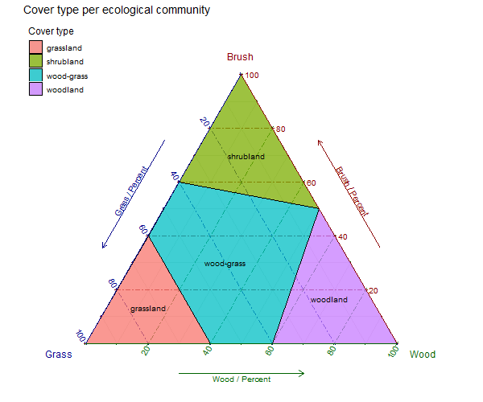

Creating definitions for cover types according to proportions of grass, brush and wood, and building ternary plot.

Re-using code from: http://www.ggtern.com/2014/01/15/usda-textural-soil-classification/

Load the required libraries

```{r}
library(ggtern)
library(plyr)
library(grid)
```

Build data frame defining cover types using proportions of grass, brush, and wood. The criteria used for separating cover types (to select runoff curve number) was inferred from footnotes in:
>Table 2.2 in: Cronshey R G 1986 Urban Hydrology for Small Watersheds, Technical Release 55 (TR-55). United States Department of Agriculture, Soil Conservation Service, Engineering Division.

```{r}
coverTypes <- data.frame(
  rbind(
    # grass | brush | wood
    c(0,   0,   1,   "woodland"),
    c(0,   .5,  .5,  "woodland"),
    c(.4,  0,   .6,  "woodland"),
    c(1,   0,   0,   "grassland"),
    c(.6,  .4,  0,   "grassland"),
    c(.6,  0,   .4,  "grassland"),
    c(.4,  .6,  0,   "wood-grass"),
    c(.6,  .4,  0,   "wood-grass"),
    c(.6,  0,   .4,  "wood-grass"),
    c(.4,  0,   .6,  "wood-grass"),
    c(0,   .5,  .5,  "wood-grass"),
    c(0,   1,   0,   "shrubland"),
    c(.4,  .6,  0,   "shrubland"),
    c(0,   .5,  .5,  "shrubland")
  )
)
names(coverTypes) <- c("Grass", "Brush", "Wood", "Label")
coverTypes$Grass <- as.numeric(as.character(coverTypes$Grass))
coverTypes$Brush <- as.numeric(as.character(coverTypes$Brush))
coverTypes$Wood <- as.numeric(as.character(coverTypes$Wood))
```

```{r}
# Put tile labels at the midpoint of each tile.
coverTypes.LAB = ddply(coverTypes, 'Label', function(df) {
    apply(df[, 1:3], 2, mean)
})
```

```{r}
png("coverTypePerEcologicalCommunity.png", width = 600, height = 500)

# Construct the plot.
ggplot(data = coverTypes, aes(y=Brush, x=Grass, z=Wood)) +
  coord_tern(L="x",T="y",R="z") +
  geom_polygon(aes(fill = Label), 
               alpha = 0.75, size = 0.5, color = 'black') +
  geom_text(data = coverTypes.LAB,
            aes(label = Label),
            color = 'black',
            size = 3.5) +
  theme_rgbw() +
  theme_showsecondary() +
  theme_showarrows() +
  custom_percent("Percent") +
  theme(legend.justification = c(0, 1),
        legend.position      = c(0, 1)) +
  labs(title = 'Cover type per ecological community',
       fill  = 'Cover type',
       color = 'Cover type')

dev.off()
```

```{r, echo=FALSE}

```
