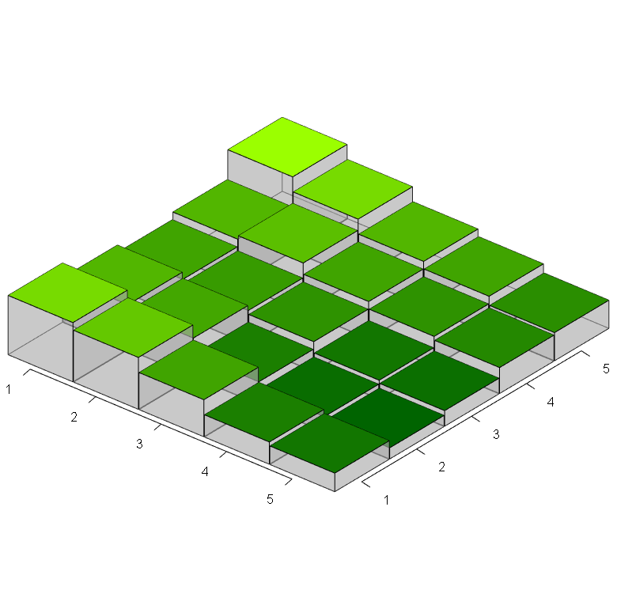
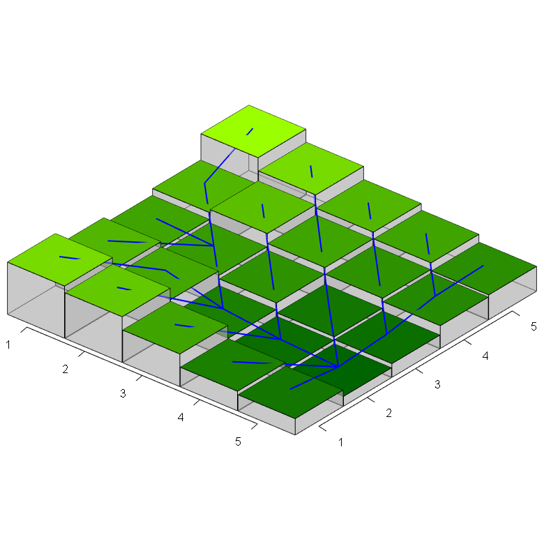
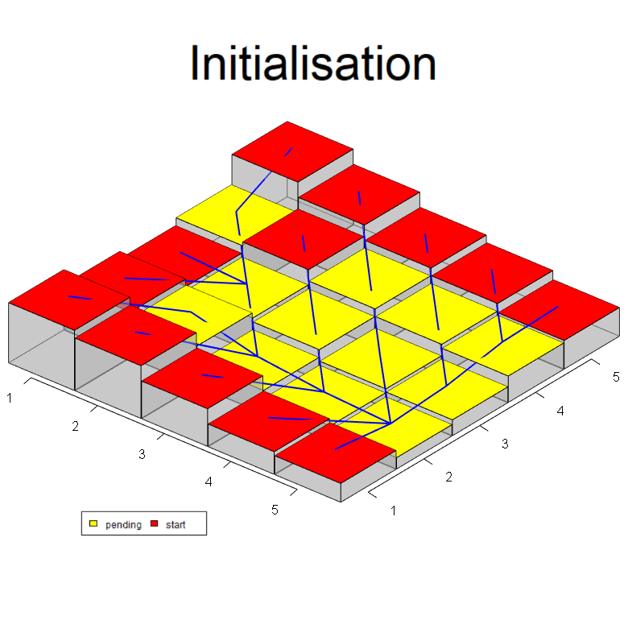
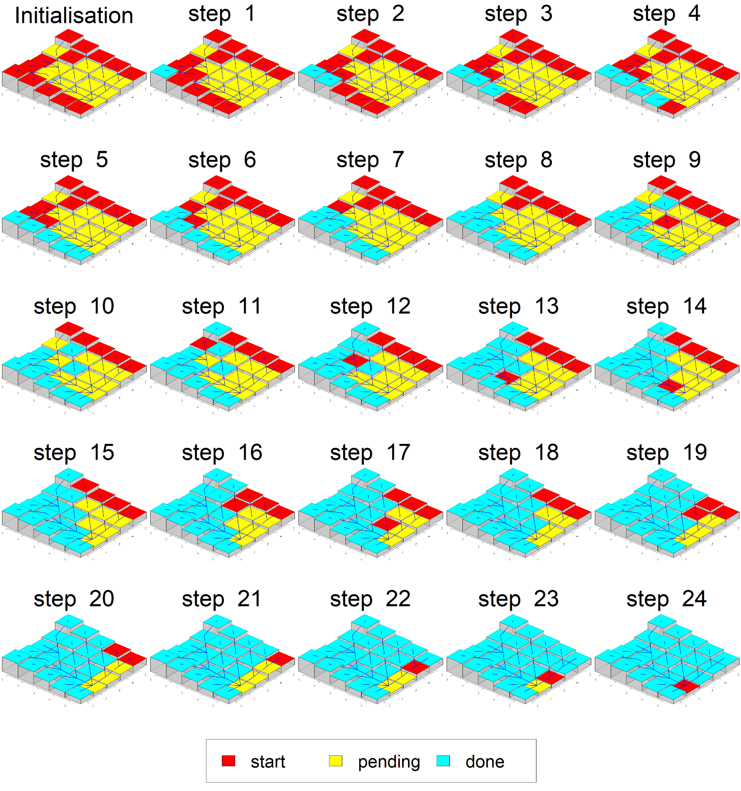
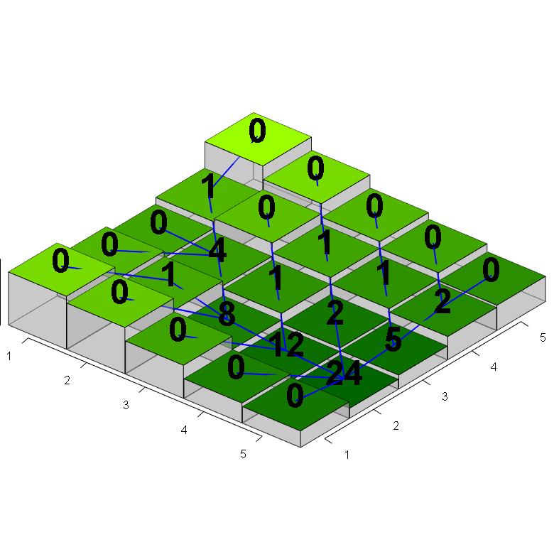

```{r}
library(barplot3d)
library(rgl)
library(grid)
library(gridExtra)
library(png)
```


The algorithm used to calculate flow_accumulation in the Land model, based on: 

>Jenson, S. K., & Domingue, J. O. (1988). Extracting topographic structure from digital elevation data for geographic information system analysis. Photogrammetric engineering and remote sensing, 54(11), 1593-1600.

The specific fragment explaining the algorithm is the following:

>"FLOW ACCUMULATION DATA SET
>The third procedure of the conditioning phase makes use of the flow direction data set to create the flow accumulation data set, where each cell is assigned a value equal to the number of cells that flow to it (O’Callaghan and Mark, 1984). Cells having a flow accumulation value of zero (to which no other cells flow) generally correspond to the pattern of ridges. Because all cells in a depressionless DEM have a path to the data set edge, the pattern formed by highlighting cells with values higher than some threshold delineates a fully connected drainage network. As the threshold value is increased, the density of the drainage network decreases. The flow accumulation data set that was calculated for the numeric example is shown in Table 2d, and the visual example is shown in Plate 1c." (p. 1594)

## Setting up an example in R

### Elevation

Build a matrix with elevation values or height map:

```{r}
elevation <- matrix( c(0.8,  0.6,  0.5,  0.6,  1,
                       0.7,  0.52, 0.45, 0.65, 0.8,
                       0.5,  0.3,  0.4,  0.5,  0.6,
                       0.3,  0.2,  0.25, 0.4,  0.5,
                       0.25, 0.15, 0.21, 0.35, 0.38),
                     nrow = 5, ncol = 5, byrow = T)
```

Set up a green shade expressing elevation gradient (adapted from NetLogo code):

```{r}
elevationGradient <- 100 + (155 * ((elevation - min(elevation)) / (max(elevation) - min(elevation) + 1E-6)))

inputdataColours <- rgb((elevationGradient - 100) / 255, 
                        (elevationGradient / 255), 
                        0)
```

Plotting using `barplot3d` package:

```{r, eval=FALSE}
# plot in rgl device
barplot3d(rows = 5, cols = 5,
          z = elevation,
          scalexy = 1,
          gap = 0.01,
          alpha = 0.4,
          theta = 40, phi = 30,
          topcolors = inputdataColours,
          xlabels = 1:5, ylabels = 1:5,
          #xsub = "rows", ysub = "columns", zsub = "elevation"
          gridlines = F
)

# save snapshot
par3d(windowRect = c(20, 30, 800, 800))
snapshot3d("flowAccumulationOrder_plot1.png")
```

```{r}

```

### Flow direction

```{r}
# function for detecting flow direction
getDownstream <- function(x, y, elevationMatrix)
{
  #print(paste("patch ", x, ", ", y))
  minDownstreamElevation = elevationMatrix[x, y]
  downstreamCoords = NULL
  
  for (dx in -1:1)
  {
    if (x + dx > 0 & x + dx <= ncol(elevationMatrix))
    {
      for (dy in -1:1)
      {
        if (y + dy > 0 & y + dy <= ncol(elevationMatrix) & 
            (dx == 0 & dy == 0) == FALSE)
        {
          #print(paste(x + dx, y + dy))
          if (elevationMatrix[x + dx, y + dy] < minDownstreamElevation)
          {
            minDownstreamElevation = elevationMatrix[x + dx, y + dy]
            downstreamCoords = c(x + dx, y + dy)
          }
        }
      }
    }
  }
  
  return(downstreamCoords)
}

# flow links
flowDirection <- c()
for (x in 1:nrow(elevation))
{
  for (y in 1:nrow(elevation))
  {
    downstreamPoint = getDownstream(x, y, elevation)
    if (!is.null(downstreamPoint))
    {
      flowDirection <- c(flowDirection, c(x, y, downstreamPoint))
    }
  }
}

flowDirection <- matrix(flowDirection, 
                    ncol = 4, 
                    nrow = length(flowDirection) / 4, 
                    byrow = T)
```

Overlap flow directions with elevation: 

```{r, eval=FALSE}
# plot in rgl device
barplot3d(rows = 5, cols = 5,
          z = elevation,
          scalexy = 1,
          gap = 0.01,
          alpha = 0.4,
          theta = 40, phi = 30,
          topcolors = inputdataColours,
          xlabels = 1:5, ylabels = 1:5,
          #xsub = "rows", ysub = "columns", zsub = "elevation"
          gridlines = F
)

for (i in 1:nrow(flowDirection))
{
  # notice that x, y, z are interpreted differently than in barplot3d
  segments3d(x = flowDirection[i, c(1, 3)]+0.5,
             z = -1*flowDirection[i, c(2, 4)]-0.5,
             y = c(elevation[flowDirection[i, 1], flowDirection[i, 2]],
                   elevation[flowDirection[i, 3], flowDirection[i, 4]])+0.05,
             color = "blue", lwd = 2)
}

# save snapshot
par3d(windowRect = c(20, 30, 800, 800))
snapshot3d("flowAccumulationOrder_plot2.png")
```

```{r}

```

### Flow accumulation

Initialisation: identify patches that receive flow ("pending" state) and those that do not ("start" state):

```{r}
# set initial values
flowReceive <- matrix(rep(FALSE, length(elevation)), 
                       nrow = nrow(elevation), ncol = ncol(elevation))
flowAccumulationState <- matrix(rep("start", length(elevation)), 
                       nrow = nrow(elevation), ncol = ncol(elevation))
flowAccumulation <- matrix(rep(0, length(elevation)), 
                       nrow = nrow(elevation), ncol = ncol(elevation))

# separate those not receiving flow
for (x in 1:nrow(elevation))
{
  for (y in 1:nrow(elevation))
  {
    downstreamPoint = getDownstream(x, y, elevation)
    if (!is.null(downstreamPoint))
    {
      flowReceive[downstreamPoint[1], downstreamPoint[2]] = TRUE
      flowAccumulationState[downstreamPoint[1], downstreamPoint[2]] = "pending"
    }
  }
}
```

```{r, eval=FALSE}
# plot in rgl device
barplot3d(rows = 5, cols = 5,
          z = elevation,
          scalexy = 1,
          gap = 0.01,
          alpha = 0.4,
          theta = 40, phi = 30,
          topcolors = c("yellow", "red")[as.factor(flowAccumulationState)],
          xlabels = 1:5, ylabels = 1:5,
          #xsub = "rows", ysub = "columns", zsub = "elevation"
          gridlines = F
)

for (i in 1:nrow(flowDirection))
{
  # notice that x, y, z are interpreted differently than in barplot3d
  segments3d(x = flowDirection[i, c(1, 3)]+0.5,
             z = -1*flowDirection[i, c(2, 4)]-0.5,
             y = c(elevation[flowDirection[i, 1], flowDirection[i, 2]],
                   elevation[flowDirection[i, 3], flowDirection[i, 4]])+0.05,
             color = "blue", lwd = 2)
}

par3d(windowRect = c(20, 30, 800, 800))

bgplot3d({
  par(mar = rep(0,4), fig = c(0,1,.8,1))
  plot.new()
  text(0.5, 0.5, labels = "Initialisation", cex = 10)
})

# save snapshot (for later)
snapshot3d("temp/flowAccumulationOrder_plot3.PNG")

bgplot3d({
  par(mar = rep(0,4), fig = c(0,1,.8,1))
  plot.new()
  text(0.5, 0.5, labels = "Initialisation", cex = 5)
  par(new = TRUE, mar = rep(0,4), fig = c(0,1,0,.2))
  plot.new()
  legend(0.1, 0.9, 
         legend = c("pending", "start"), fill = c("yellow", "red"), 
         horiz = TRUE)
})

# save snapshot (for now)
snapshot3d("flowAccumulationOrder_plot3.png")
```

```{r}

```

Declare function to find if inflowing neighbours state is "done":

```{r}
areInflowNeighboursDone <- function(x, y, stateMatrix, elevationMatrix)
{
  neighboursAreDone = TRUE
  
  for (dx in -1:1)
  {
    if (x + dx > 0 & x + dx <= ncol(stateMatrix))
    {
      for (dy in -1:1)
      {
        if (y + dy > 0 & y + dy <= ncol(stateMatrix) & 
            (dx == 0 & dy == 0) == FALSE)
        {
          flowTarget = getDownstream(x + dx, y + dy, elevationMatrix)
          
          if (!is.null(flowTarget) &&
              all(flowTarget == c(x, y)) && 
              stateMatrix[x + dx, y + dy] != "done")
          {
            neighboursAreDone = FALSE
          }
        }
      }
    }
  }
  
  return(neighboursAreDone)
}
```

Loop iteration until there is no land units with flowAccumulationState equals "pending" or "start":

```{r, eval=FALSE}
currentStep = 1
maxIterations = 30 # just as a safety measure, to avoid infinite loop
while(maxIterations > currentStep & 
      "start" %in% flowAccumulationState &
      "pending" %in% flowAccumulationState)
{
  # select one land unit with flowAccumulationState == "start"
  sourcePoint = which(flowAccumulationState == "start", arr.ind = T)[1,]
  
  # find downstream point
  downstreamPoint = getDownstream(sourcePoint[1], sourcePoint[2], elevation)
  
  # add accumulation at source plus 1 to flow accumulation downstream
  flowAccumulation[downstreamPoint[1], downstreamPoint[2]] = flowAccumulation[downstreamPoint[1], downstreamPoint[2]] +
    flowAccumulation[sourcePoint[1], sourcePoint[2]] + 1
  
  # set source state as "done"
  flowAccumulationState[sourcePoint[1], sourcePoint[2]] = "done"
  
  # if all downstream's neigbours are "done", set its state as "start" 
  if (areInflowNeighboursDone(downstreamPoint[1], 
                              downstreamPoint[2], 
                              flowAccumulationState, 
                              elevation))
  {
    flowAccumulationState[downstreamPoint[1], downstreamPoint[2]] = "start"
  }
  
  # plot in rgl device
  barplot3d(rows = 5, cols = 5,
            z = elevation,
            scalexy = 1,
            gap = 0.01,
            alpha = 0.4,
            theta = 40, phi = 30,
            topcolors = c("cyan", "yellow", "red")[factor(flowAccumulationState, levels = c("done", "pending", "start"))],
            xlabels = 1:5, ylabels = 1:5,
            #xsub = "rows", ysub = "columns", zsub = "elevation"
            gridlines = F
  )
  
  for (i in 1:nrow(flowDirection))
  {
    # notice that x, y, z are interpreted differently than in barplot3d
    segments3d(x = flowDirection[i, c(1, 3)]+0.5,
               z = -1*flowDirection[i, c(2, 4)]-0.5,
               y = c(elevation[flowDirection[i, 1], flowDirection[i, 2]],
                     elevation[flowDirection[i, 3], flowDirection[i, 4]])+0.05,
               color = "blue", lwd = 2)
  }
  
  par3d(windowRect = c(20, 30, 800, 800))
  
  bgplot3d({
    par(mar = rep(0,4), fig = c(0,1,.8,1))
    plot.new()
    text(0.5, 0.5, labels = paste("step ", currentStep), cex = 10)
  })
  
  # save snapshot
  snapshot3d(paste0("temp/flowAccumulationOrder_plot4_step", 
                    currentStep ,".PNG"))
  
  rgl::rgl.close()
  
  currentStep = currentStep + 1
}
```

```{r, eval=FALSE}

# create image for legend
png("temp/flowAccumulationOrder_plot4_legend.PNG", 
    width = 1500, height = 200)

par(mar = rep(0,4), cex = 5)

plot(0:1, 0:1, type = "n", axes = FALSE, ann = FALSE)
legend(0.1, 0.9, 
       legend = c("start", "pending", "done"), 
       fill = c("red", "yellow", "cyan"), 
       horiz = TRUE)

dev.off()

# it is important that these plots were saved as "PNG not "png"
listOfPlots <- c("temp/flowAccumulationOrder_plot3.PNG",
                 paste0("temp/flowAccumulationOrder_plot4_step", 
                    1:(currentStep - 1) ,".PNG"),
                 "temp/flowAccumulationOrder_plot4_legend.PNG")

grobs <- lapply(lapply(listOfPlots, png::readPNG), grid::rasterGrob)

lay <- rbind(1:5, 6:10, 11:15, 16:20, 21:25, rep(26, 5))

png("flowAccumulationOrder_plot4.png", 
    width = 1500, height = 1600)

gridExtra::grid.arrange(grobs = grobs, 
                        layout_matrix = lay,
                        heights = unit(c(rep(.185, 5), .075), "npc"))

dev.off()
```

```{r}

```

The final values of flow accumulation are:

```{r, eval=FALSE}
# plot in rgl device
barplot3d(rows = 5, cols = 5,
          z = elevation,
          scalexy = 1,
          gap = 0.01,
          alpha = 0.4,
          theta = 40, phi = 30,
          topcolors = inputdataColours,
          xlabels = 1:5, ylabels = 1:5,
          #xsub = "rows", ysub = "columns", zsub = "elevation"
          gridlines = F
)

for (i in 1:nrow(flowDirection))
{
  # notice that x, y, z are interpreted differently than in barplot3d
  segments3d(x = flowDirection[i, c(1, 3)]+0.5,
             z = -1*flowDirection[i, c(2, 4)]-0.5,
             y = c(elevation[flowDirection[i, 1], flowDirection[i, 2]],
                   elevation[flowDirection[i, 3], flowDirection[i, 4]])+0.05,
             color = "blue", lwd = 2)
}

# mark flow accumulation values
for (x in 1:nrow(elevation))
{
  for (y in 1:nrow(elevation))
  {
    # notice that x, y, z are interpreted differently than in barplot3d
    text3d(x = x+0.5, y = elevation[x, y]+0.2, z = -1*y-0.5,
           text = flowAccumulation[x, y],
           cex = 3, font = 2)
  }
}

# save snapshot
par3d(windowRect = c(20, 30, 800, 800))
snapshot3d("flowAccumulationOrder_plot5.png")
```

```{r}

```
