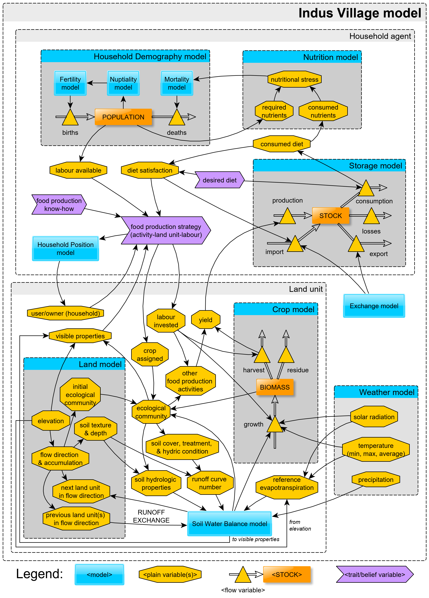

# Indus Village model

Collection of files associated with the Indus Village model, including separate modules implementations, demonstrations, tests, and pseudo-code diagrams.

Overall design of the Indus Village model:

Road map of consolidated submodels and integrated versions so far (May 2021):

Visit the repository [Wiki](https://github.com/Andros-Spica/indus-village-model/wiki) to access all documentation materials.
