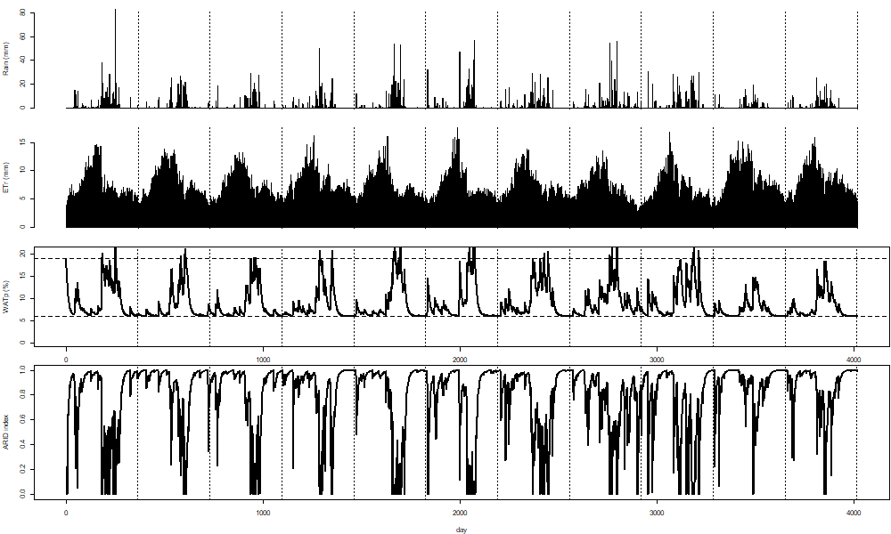
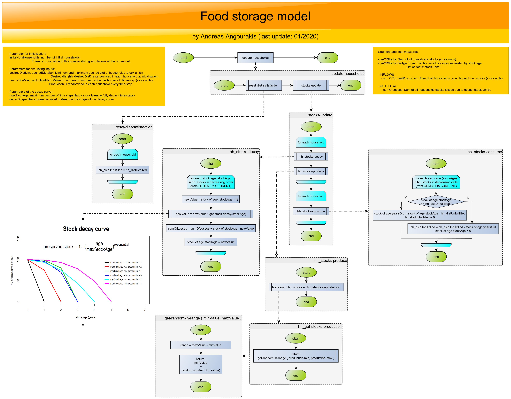
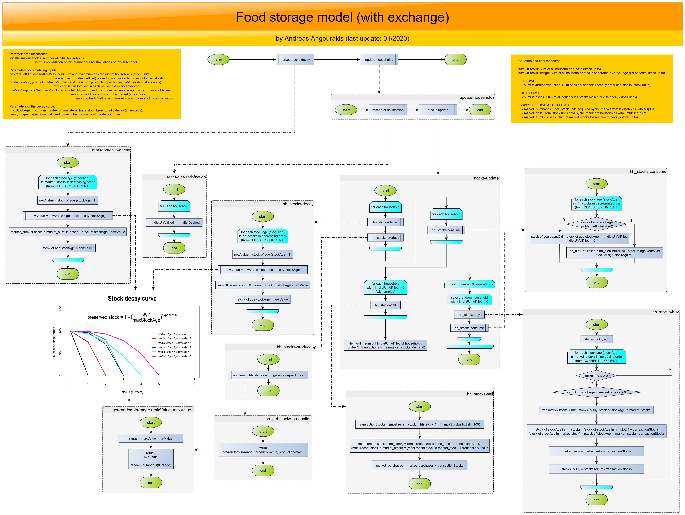

# Indus Village model

Collection of files associated with the Indus Village model, including separate modules implementations, demonstrations, tests, and pseudo-code diagrams.

Overall design of the Indus Village model:

## Weather model

See the study on precipitation patterns done for the development of the parametric precipitation model: https://github.com/Andros-Spica/parModelPrecipitation

## Soil Water Balance model

## Land model

## Crop model

## Household Demography model

## Food Storage model

### With local exchange mechanism

In this version, the Food Storage model is complemented by a exchange mechanism that describes a common "market" that "buys" the surplus stock units released by households, stores them, and "sells" them back to households needing extra units to fulfill their desired diet. This "market" is called as such in sake of implementation simplicity; it is actually more representative of a centralised redistribution institution, because there is no accountability of value of stock units "bought" or "sold" by households and, thus, no stock unit price.

